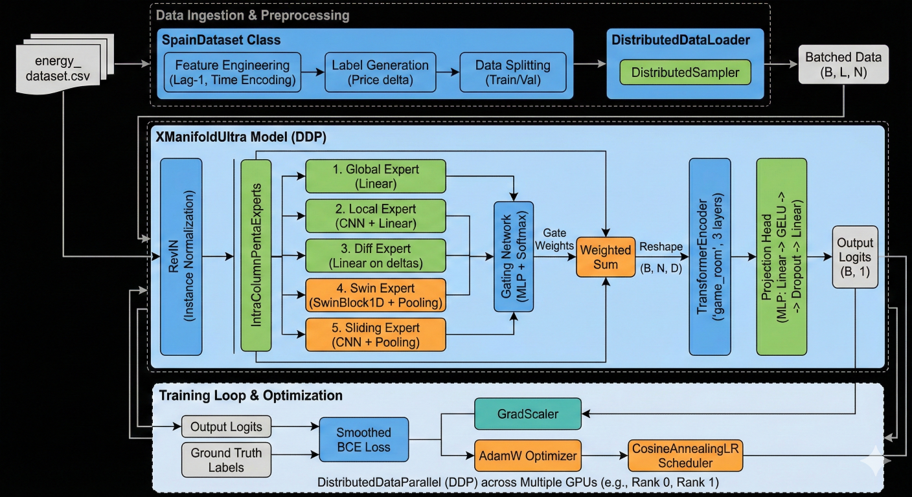

# XManifoldUltra(Fishs-transformer): Advanced Energy Price Forecasting

**XManifoldUltra** 是一种高性能深度学习架构，专为电力价格波动的二分类预测（上涨或下跌）而设计。通过集成 **五专家门控系统 (MoE)** 与 **基于 Transformer 的变量间编码器**，该模型能够在保持严格“零泄露”训练环境的同时，捕捉波动时间序列数据中的复杂模式。

---

## 🏗️ 架构概览 (Model Architecture)

该模型通过多个复杂的层级处理多变量时间序列数据，以确保鲁棒的特征提取和关系建模。


### 核心组件
* **RevIN (Reversible Instance Normalization)**: 通过动态归一化和处理分布位移 (Distribution Shift)，有效应对电力价格的非平稳性。
* **IntraColumnPentaExperts (5-Expert MoE)**: 针对异构特征设计的五分支混合专家系统：
    1. **Global Expert**: 线性投影提取全局长期趋势。
    2. **Local Expert**: 1D-CNN 识别短期局部模式。
    3. **Diff Expert**: 关注一阶导数（价格增量），捕捉瞬时变化率。
    4. **Swin Expert**: 利用 **1D Swin Transformer** 移动窗口机制，提取层次化时间注意力。
    5. **Sliding Expert**: 通过自适应池化捕捉局部特征的统计显著性。
* **Game Room (Transformer Encoder)**: 3 层 Transformer 架构，专门模拟不同变量（如太阳能出力与电网负荷）之间复杂的非线性“博弈”关系。
* **Zero-Leakage Pipeline**: 严苛的数据引擎，强制执行 1 步特征滞后 (Lag-1)，确保模型在预测时仅使用已知信息，彻底杜绝数据泄露。
---

## 📊 工业级异构数据集 (Dataset Description)

本项目采用 [Spain Energy Dataset (Kaggle)]
(https://www.kaggle.com/datasets/nicholasjhana/energy-consumption-generation-prices-and-weather/data) (2015–2018)。

### 变量异构性深度解析
该数据集包含物理属性迥异的四类变量，对模型的通用建模能力提出了极高要求：

| 变量类别 | 数据统计特性 | 预测难度 | 核心挑战 |
| :--- | :--- | :---: | :--- |
| **核能发电** | 极其平稳、几乎呈恒定直线 | 低 | 几乎无波动，主要作为基荷参考 |
| **风能/太阳能** | 随机、间歇、具有日周期性 | 中 | 需精准捕捉气象触发的瞬时波动 |
| **电力负荷** | 强周期性 (日/周/季)，天气敏感 | 中 | 识别极端天气导致的非线性负荷突变 |
| **电力价格** | **高噪声、非平稳、存在极端尖峰** | **极高** | 处理异构变量间的复杂耦合与非线性关系 |

## 📊 Dataset: Spain Energy Grid (Kaggle)
本项目使用 [Spain Energy Dataset (2015–2018)](https://www.kaggle.com/datasets/nicholasjhana/energy-consumption-generation-prices-and-weather/data)，这是一个极具挑战性的工业级异构数据集。

### 数据集特点
* **异构性极高**：整合了 12 种发电方式（如核能、风能、太阳能等）以及西班牙 5 大城市的 30 多个气象指标。
* **变量特性分析**：
    | 变量类别 | 数据特性 | 预测难度 | 核心挑战 |
    | :--- | :--- | :---: | :--- |
    | **核能发电** | 极其平稳、几乎恒定 | 低 | 主要作为基荷参考 |
    | **风能/太阳能** | 随机、间歇、具有日周期性 | 中 | 捕捉气象触发的瞬时波动 |
    | **电力负荷** | 强周期性 (日/周/季) | 中 | 识别极端天气导致的负荷突变 |
    | **电力价格** | 高噪声、非平稳、存在极端尖峰 | **极高** | 处理异构变量间的非线性耦合 |

### 学术认可
该数据集被广泛用于验证时间序列前沿模型（如 CNN-LSTM、Transformer、时序大模型）在现实复杂扰动下的抗压能力。
**MDPI** 等多家知名学术期刊均以此作为核心工业 Benchmark：


**代表性论文：**
* *MDPI - Energies (2026)*: [Predictive Models for Renewable Energy Generation and Demand in Smart Cities: A Spatio-Temporal Framework](https://www.mdpi.com/1996-1073/19/1/87)
* *MDPI - Machine Learning and Knowledge Extraction (2023)*: [Artificial Intelligence-Based Prediction of Spanish Energy Pricing](https://www.mdpi.com/2504-4990/5/2/26)

---

## 🚀 性能对标 (Benchmarking Results)

在严格的零泄露约束下，**XManifoldUltra** 显著优于目前主流的工业级标准 Baseline：

| Model Architecture | Max Val Accuracy | Key Characteristic |
| :--- | :---: | :--- |
| **XManifoldUltra (Ours)** | **82.09%** | **Multi-scale MoE + Inter-variable Transformer** |
| PatchTST | 81.28% | Patch-based linear Transformer |
| iTransformer | 81.17% | Dimension-inverted Transformer |
| TSMixer | 80.34% | All-MLP Mixing architecture |
| TimesNet | 80.07% | Multi-period 2D convolution transformation |

---

## 💻 核心模型实现 (XManifoldUltra)

```python
import os
import torch
import torch.nn as nn
import torch.nn.functional as F
# ... (此处建议插入完整的模型定义代码或引用脚本文件)
